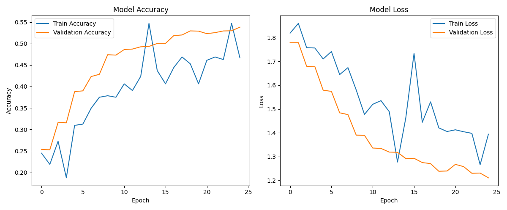
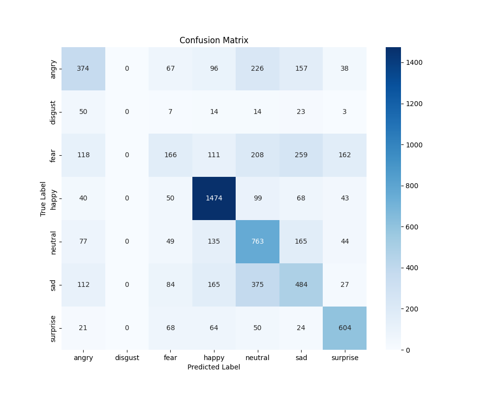

It sounds like you uploaded the file, but maybe you uploaded an empty one or the text didn't save correctly.

Since you prefer the manual way, the **easiest fix** is to edit the file directly on the GitHub website. You don't need to re-upload anything.

Here is how to fix it in 30 seconds:

### Step 1: Go to the File on GitHub

1.  Open your repository page in your browser.
2.  Click on the file named **`README.md`** in the file list.
3.  Look for the **Pencil Icon** (✏️) in the top right corner of the file view. Click it.

### Step 2: Paste the Code

You will now see a text editor. Delete whatever is currently in there, and **copy-paste this entire block below**. I have formatted it correctly so the headers and bold text show up nicely.

````markdown
# Facial Emotion Recognition using CNN


A Deep Learning project that identifies human facial expressions from images. Using a Convolutional Neural Network (CNN) trained on the FER2013 dataset, the model can classify faces into 7 emotions: **Angry, Disgust, Fear, Happy, Sad, Surprise, and Neutral.**

## 📊 Results & Performance
The model was trained for 25 epochs. Below are the performance metrics.

### 1. Accuracy & Loss Curves
The model shows a steady increase in accuracy, reaching competitive validation accuracy for this dataset.


### 2. Confusion Matrix
The confusion matrix shows how well the model predicts each specific emotion.
* **Happy** is the most accurate class.
* **Fear** and **Sad** are occasionally confused, which is common in facial recognition due to similar micro-expressions.


## 🛠️ Tech Stack
* **Language:** Python
* **Libraries:** TensorFlow (Keras), NumPy, Pandas, Matplotlib, Seaborn
* **Dataset:** FER2013 (Facial Expression Recognition 2013)

## 🚀 How to Run
1. **Clone the repository:**
   ```bash
   git clone [https://github.com/Karanpahwa2005/facial-emotion-recognition-cnn.git](https://github.com/Karanpahwa2005/facial-emotion-recognition-cnn.git)
   cd facial-emotion-recognition-cnn
````

2.  **Install dependencies:**

    ```bash
    pip install -r requirements.txt
    ```

3.  **Run the training script:**

    ```bash
    python main.py
    ```

## 🔮 Future Scope

  * Implement **Real-time detection** using OpenCV and webcam feed.
  * Use **Transfer Learning** (ResNet50 or VGG16) to boost accuracy to \~75%.
  * Deploy as a web app using **Streamlit**.

-----

*Created by [Karan Pahwa]*

```

### Step 3: Save the Changes
1.  Scroll down to the bottom of the page.
2.  You will see a box that says **"Commit changes"**.
3.  Type a message like: `Update README content`.
4.  Click the green **Commit changes** button.

Now, go back to the main page of your repository (click the "Code" tab). You should see your beautiful README displayed immediately!
```
